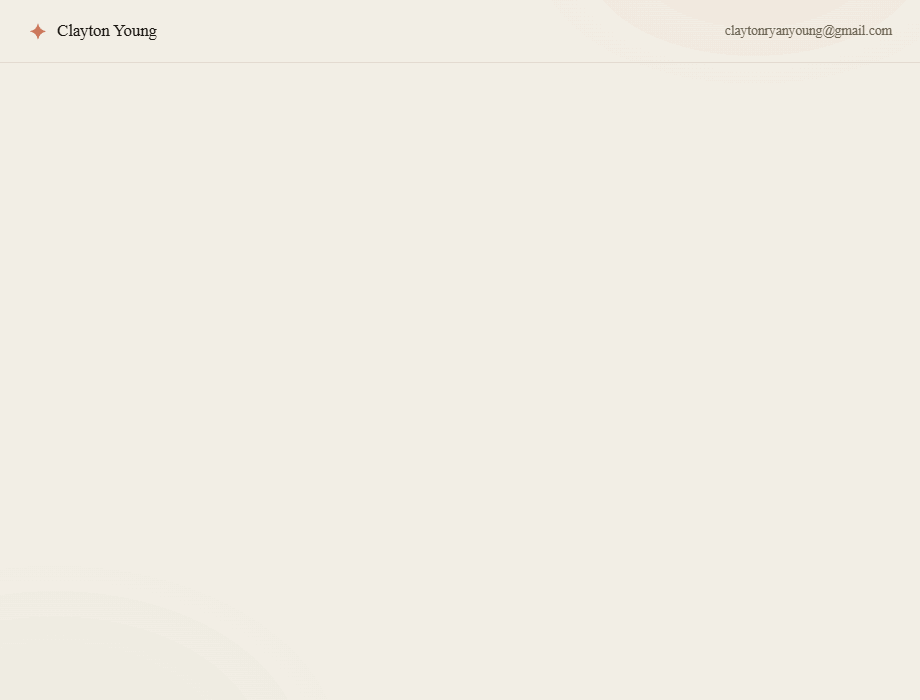

# Clayton Young — an interactive résumé, four ways

Built for Anthropic's **Design Engineer, Web** role (Creative Studio). The role is about craft, motion, and making things by hand — so instead of a static PDF, this is my résumé built four different ways, in Anthropic's visual language.



**Live:** [anthropic-resume.pages.dev](https://anthropic-resume.pages.dev) · **Stack:** React · Next.js (App Router) · TypeScript · Framer Motion

---

## The four lenses

| | Lens | What it demonstrates |
|---|---|---|
| 01 | [Talk to my résumé](https://anthropic-resume.pages.dev/talk) | A streamed, token-by-token chat about my work — thinking beat, live markdown, auto-pinned scroll. Canned + fully offline (swap in the Claude API in an afternoon). |
| 02 | [Anthropic-brand interactive page](https://anthropic-resume.pages.dev/brand) | An editorial, marketing-quality scroll story — brand expression, typography, restrained motion. |
| 03 | [Data-viz résumé](https://anthropic-resume.pages.dev/data) | My career as data visualization — animated counters, spring-filled skill bars, a timeline. |
| 04 | [Living design system](https://anthropic-resume.pages.dev/system) | The site's own system, taken apart — color tokens, a type specimen, live components, interactive motion tiles. |

## The craft under it

- **One token system** — every color, radius, and shadow is a CSS variable; the serif/sans pairing (Newsreader + Inter) and the clay palette carry across all five pages.
- **Motion with restraint** — shared spring tokens, scroll-triggered reveals, and full `prefers-reduced-motion` support (streams resolve instantly, reveals disable).
- **Performance-minded** — static export, transform/opacity animation only, `rAF`-driven streaming, ~130 kB first load.
- **TypeScript throughout** — typed conversation model, data-driven pages, no UI dependencies beyond Framer Motion.

## Run it

```bash
npm install
npm run dev      # http://localhost:3000
```

## Build & deploy (static export)

```bash
npm run build    # fully static site in ./out
npx wrangler pages deploy out --project-name=anthropic-resume
```

## Structure

```
app/            layout, design tokens (globals.css), landing + the four lens routes
components/     Nav, Reveal, chat/ (Message, Composer, StreamingText, Markdown), data/ (Counter)
lib/            ui (motion tokens, shared facts), chat (typed model + replies), useChat
```

Built from scratch by [Clayton Young](https://github.com/Youngs-World) — [claytonryanyoung@gmail.com](mailto:claytonryanyoung@gmail.com)
